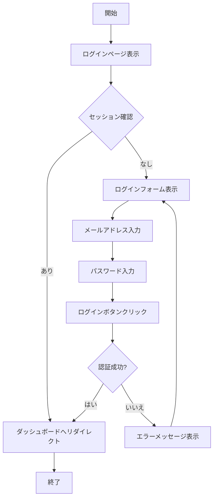
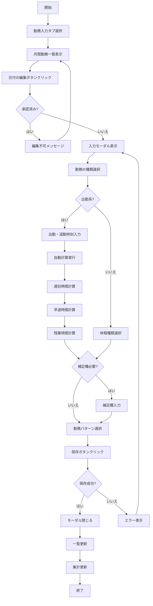
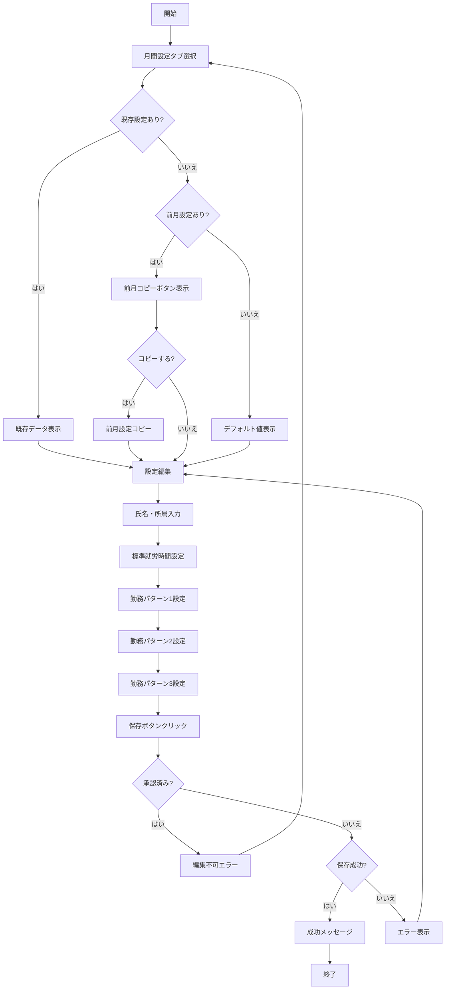
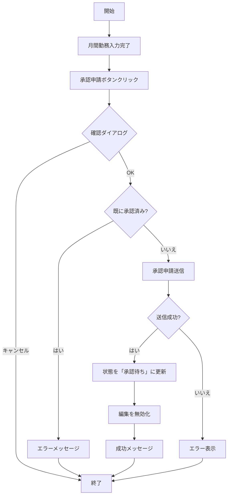
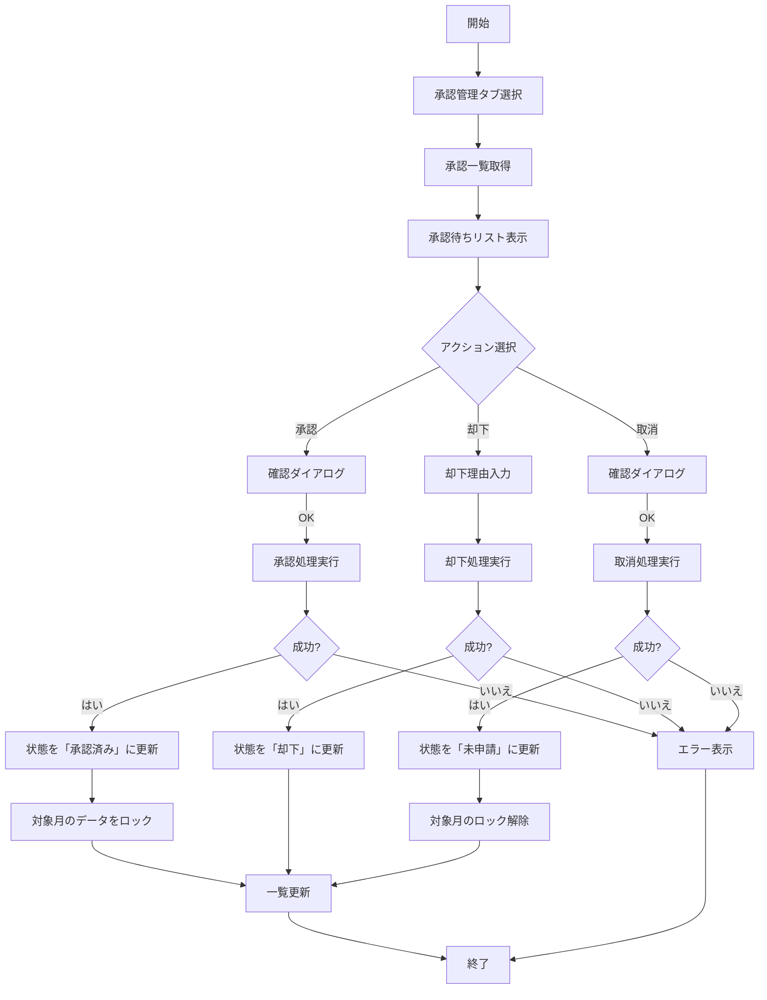
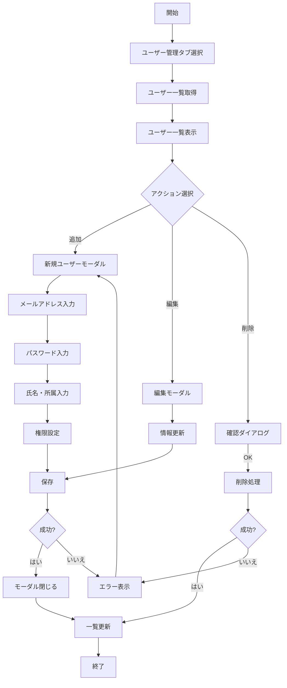
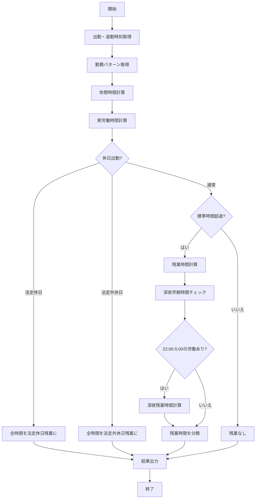
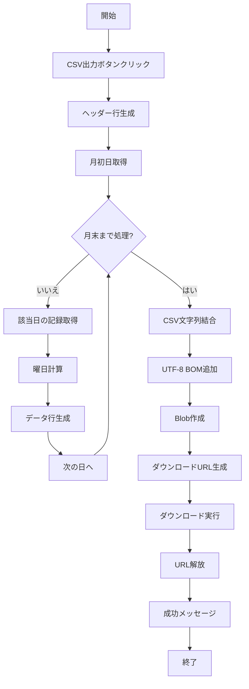

# アクティビティ図

勤務月報システムの主要なアクティビティフローを示します。

## 1. ログインフロー

```mermaid
flowchart TD
    A[開始] --> B[ログインページ表示]
    B --> C{セッション確認}
    C -->|あり| D[ダッシュボードへリダイレクト]
    C -->|なし| E[ログインフォーム表示]
    E --> F[メールアドレス入力]
    F --> G[パスワード入力]
    G --> H[ログインボタンクリック]
    H --> I{認証成功?}
    I -->|はい| D
    I -->|いいえ| J[エラーメッセージ表示]
    J --> E
    D --> K[終了]
```

## 2. 日毎勤務入力フロー

```mermaid
flowchart TD
    A[開始] --> B[勤務入力タブ選択]
    B --> C[月間勤務一覧表示]
    C --> D[日付の編集ボタンクリック]
    D --> E{承認済み?}
    E -->|はい| F[編集不可メッセージ]
    F --> C
    E -->|いいえ| G[入力モーダル表示]
    G --> H[勤務の種類選択]
    H --> I{出勤系?}
    I -->|はい| J[出勤・退勤時刻入力]
    I -->|いいえ| K[休暇種類選択]
    J --> L[自動計算実行]
    L --> M[遅刻時間計算]
    M --> N[早退時間計算]
    N --> O[残業時間計算]
    O --> P{補足欄必要?}
    K --> P
    P -->|はい| Q[補足欄入力]
    P -->|いいえ| R[勤務パターン選択]
    Q --> R
    R --> S[保存ボタンクリック]
    S --> T{保存成功?}
    T -->|はい| U[モーダル閉じる]
    U --> V[一覧更新]
    V --> W[集計更新]
    W --> X[終了]
    T -->|いいえ| Y[エラー表示]
    Y --> G
```

## 3. 月間設定フロー

```mermaid
flowchart TD
    A[開始] --> B[月間設定タブ選択]
    B --> C{既存設定あり?}
    C -->|はい| D[既存データ表示]
    C -->|いいえ| E{前月設定あり?}
    E -->|はい| F[前月コピーボタン表示]
    E -->|いいえ| G[デフォルト値表示]
    D --> H[設定編集]
    F --> I{コピーする?}
    I -->|はい| J[前月設定コピー]
    J --> H
    I -->|いいえ| H
    G --> H
    H --> K[氏名・所属入力]
    K --> L[標準就労時間設定]
    L --> M[勤務パターン1設定]
    M --> N[勤務パターン2設定]
    N --> O[勤務パターン3設定]
    O --> P[保存ボタンクリック]
    P --> Q{承認済み?}
    Q -->|はい| R[編集不可エラー]
    R --> B
    Q -->|いいえ| S{保存成功?}
    S -->|はい| T[成功メッセージ]
    T --> U[終了]
    S -->|いいえ| V[エラー表示]
    V --> H
```

## 4. 承認申請フロー

```mermaid
flowchart TD
    A[開始] --> B[月間勤務入力完了]
    B --> C[承認申請ボタンクリック]
    C --> D{確認ダイアログ}
    D -->|キャンセル| E[終了]
    D -->|OK| F{既に承認済み?}
    F -->|はい| G[エラーメッセージ]
    G --> E
    F -->|いいえ| H[承認申請送信]
    H --> I{送信成功?}
    I -->|はい| J[状態を「承認待ち」に更新]
    J --> K[編集を無効化]
    K --> L[成功メッセージ]
    L --> E
    I -->|いいえ| M[エラー表示]
    M --> E
```

## 5. 承認処理フロー（承認者）

```mermaid
flowchart TD
    A[開始] --> B[承認管理タブ選択]
    B --> C[承認一覧取得]
    C --> D[承認待ちリスト表示]
    D --> E{アクション選択}
    E -->|承認| F[確認ダイアログ]
    F -->|OK| G[承認処理実行]
    G --> H{成功?}
    H -->|はい| I[状態を「承認済み」に更新]
    I --> J[対象月のデータをロック]
    J --> K[一覧更新]
    K --> L[終了]
    H -->|いいえ| M[エラー表示]
    M --> L
    E -->|却下| N[却下理由入力]
    N --> O[却下処理実行]
    O --> P{成功?}
    P -->|はい| Q[状態を「却下」に更新]
    Q --> K
    P -->|いいえ| M
    E -->|取消| R[確認ダイアログ]
    R -->|OK| S[取消処理実行]
    S --> T{成功?}
    T -->|はい| U[状態を「未申請」に更新]
    U --> V[対象月のロック解除]
    V --> K
    T -->|いいえ| M
```

## 6. ユーザー管理フロー（管理者）

```mermaid
flowchart TD
    A[開始] --> B[ユーザー管理タブ選択]
    B --> C[ユーザー一覧取得]
    C --> D[ユーザー一覧表示]
    D --> E{アクション選択}
    E -->|追加| F[新規ユーザーモーダル]
    F --> G[メールアドレス入力]
    G --> H[パスワード入力]
    H --> I[氏名・所属入力]
    I --> J[権限設定]
    J --> K[保存]
    K --> L{成功?}
    L -->|はい| M[モーダル閉じる]
    M --> N[一覧更新]
    N --> O[終了]
    L -->|いいえ| P[エラー表示]
    P --> F
    E -->|編集| Q[編集モーダル]
    Q --> R[情報更新]
    R --> K
    E -->|削除| S[確認ダイアログ]
    S -->|OK| T[削除処理]
    T --> U{成功?}
    U -->|はい| N
    U -->|いいえ| P
```

## 7. 残業時間計算フロー

```mermaid
flowchart TD
    A[開始] --> B[出勤・退勤時刻取得]
    B --> C[勤務パターン取得]
    C --> D[休憩時間計算]
    D --> E[実労働時間計算]
    E --> F{休日出勤?}
    F -->|法定休日| G[全時間を法定休日残業に]
    F -->|法定外休日| H[全時間を法定外休日残業に]
    F -->|通常| I{標準時間超過?}
    I -->|はい| J[残業時間計算]
    J --> K[深夜早朝時間チェック]
    K --> L{22:00-5:00の労働あり?}
    L -->|はい| M[深夜残業時間計算]
    M --> N[残業時間を分類]
    L -->|いいえ| N
    I -->|いいえ| O[残業なし]
    G --> P[結果出力]
    H --> P
    N --> P
    O --> P
    P --> Q[終了]
```

## 8. CSVエクスポートフロー

```mermaid
flowchart TD
    A[開始] --> B[CSV出力ボタンクリック]
    B --> C[ヘッダー行生成]
    C --> D[月初日取得]
    D --> E{月末まで処理?}
    E -->|いいえ| F[該当日の記録取得]
    F --> G[曜日計算]
    G --> H[データ行生成]
    H --> I[次の日へ]
    I --> E
    E -->|はい| J[CSV文字列結合]
    J --> K[UTF-8 BOM追加]
    K --> L[Blob作成]
    L --> M[ダウンロードURL生成]
    M --> N[ダウンロード実行]
    N --> O[URL解放]
    O --> P[成功メッセージ]
    P --> Q[終了]
```
