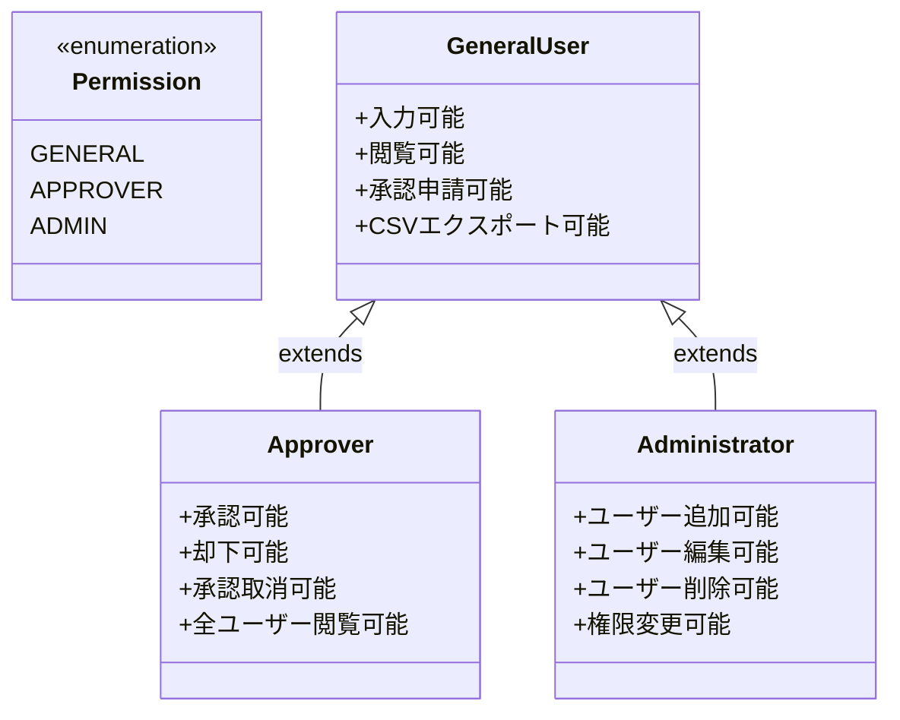

# クラス図

勤務月報システムのクラス構造を示します。

## クラス説明

### エンティティクラス

| クラス名 | 説明 |
|---------|------|
| User | Supabase Authのユーザー情報 |
| UserProfile | ユーザーのプロフィール情報と権限 |
| MonthlySettings | 月間の勤務設定（勤務パターン、標準就労時間など） |
| WorkPattern | 勤務パターン（始業・終業時刻と休憩時間） |
| Break | 休憩時間（開始・終了時刻） |
| DailyRecord | 日毎の勤務記録 |
| Approval | 承認状態 |

### モジュールクラス

| クラス名 | 説明 |
|---------|------|
| AuthModule | 認証機能を提供 |
| TimecardModule | 勤務時間の入力・計算機能を提供 |
| AdminModule | ユーザー管理機能を提供 |
| ApprovalModule | 承認機能を提供 |
| AppModule | メインアプリケーションロジック |

### 権限レベル

