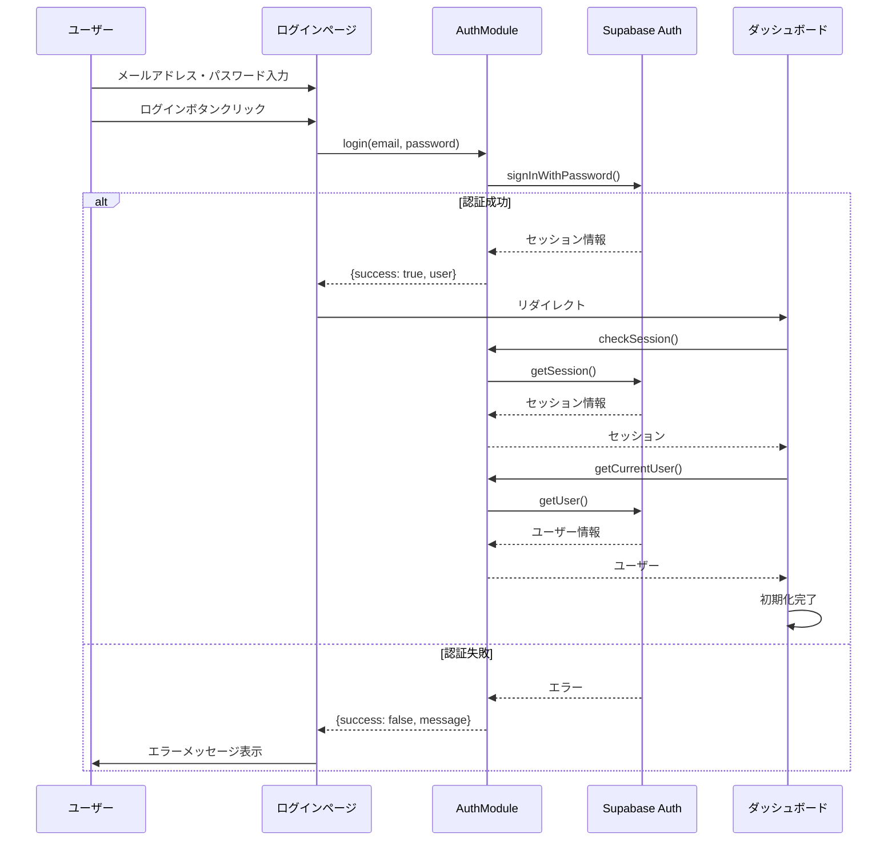
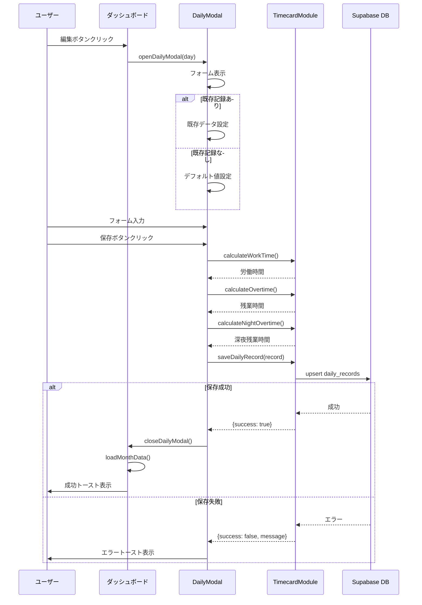
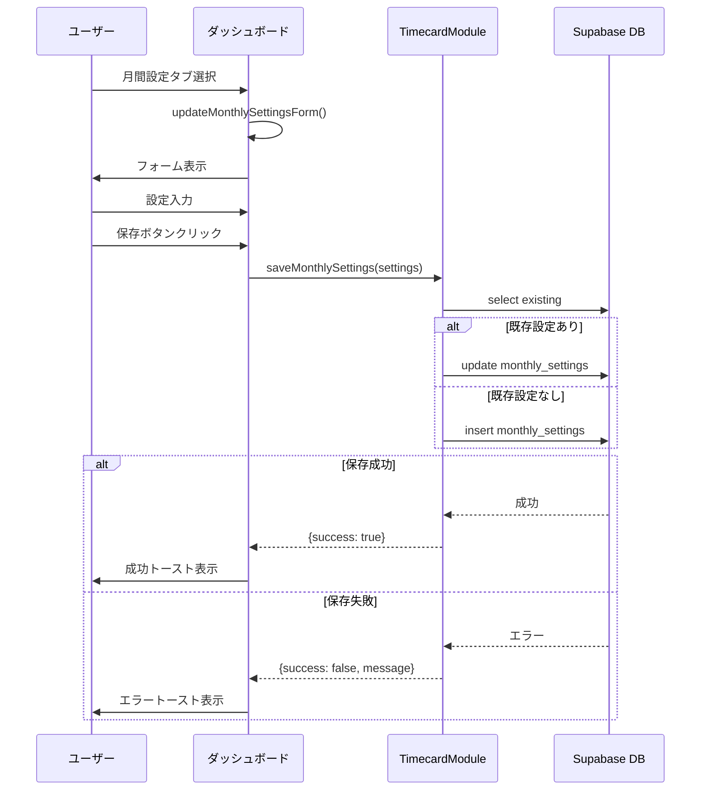
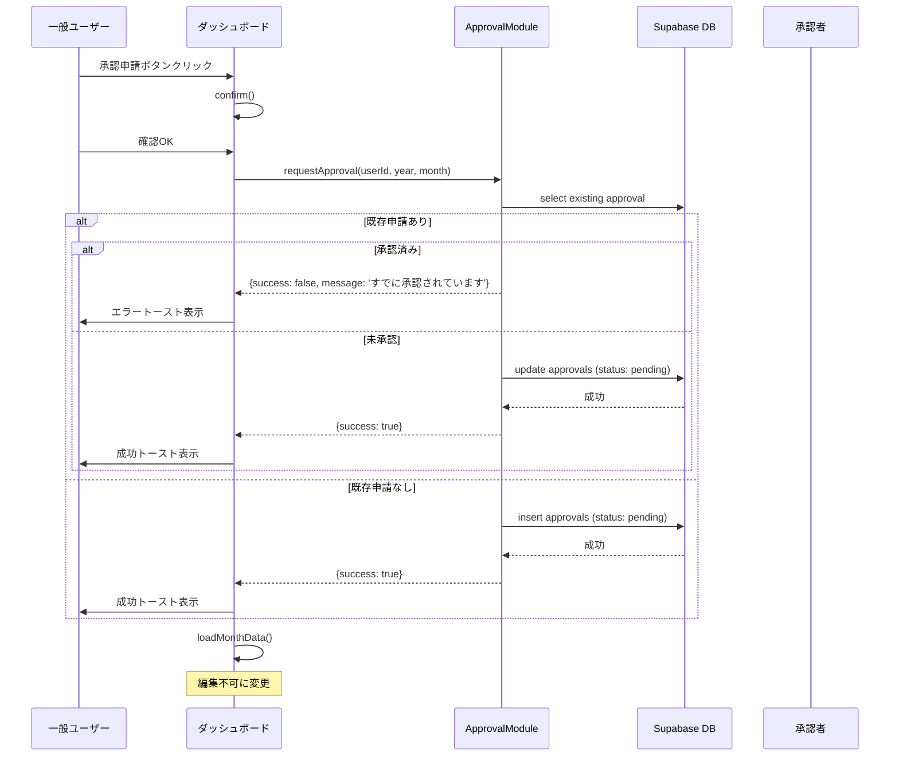
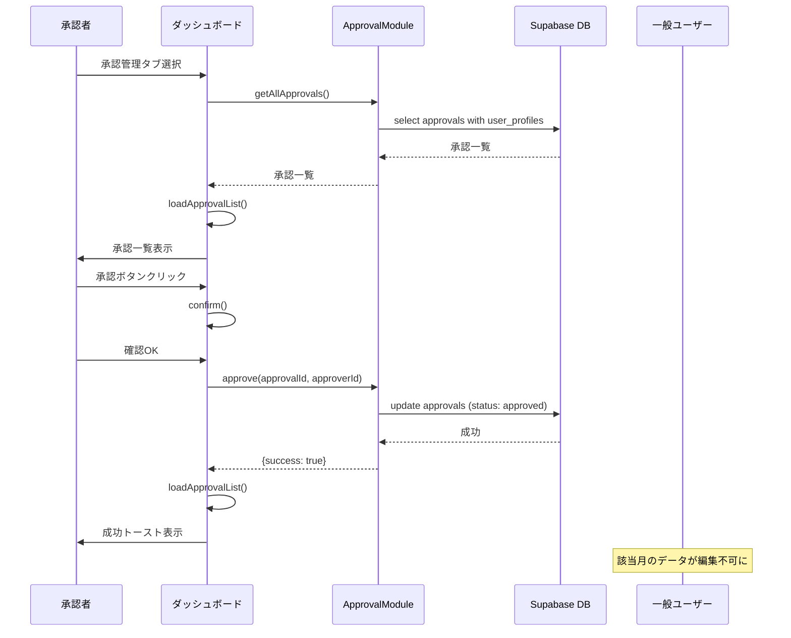
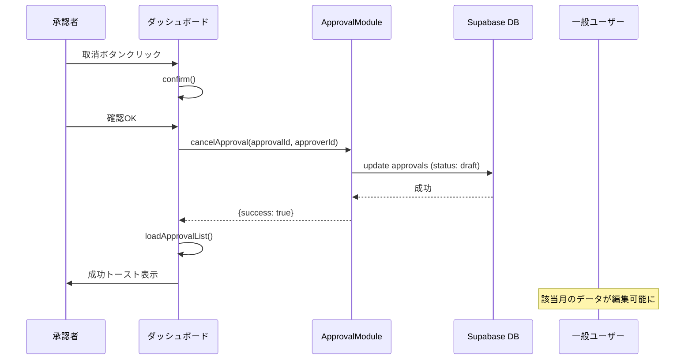
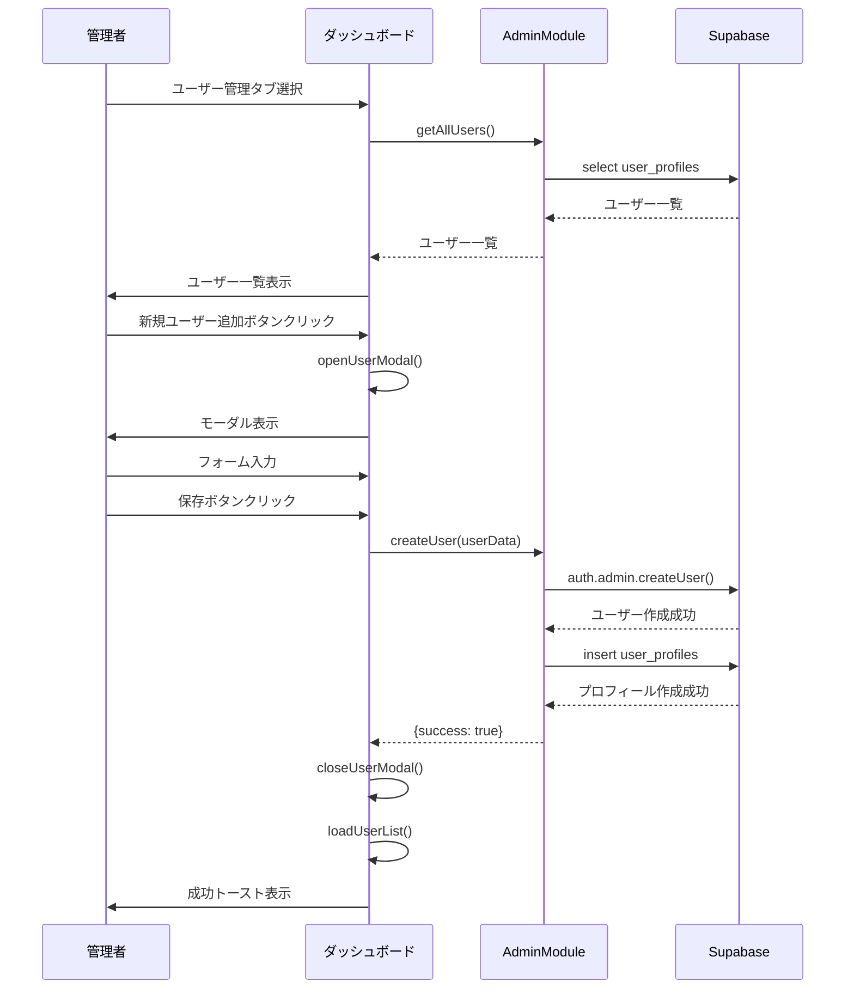
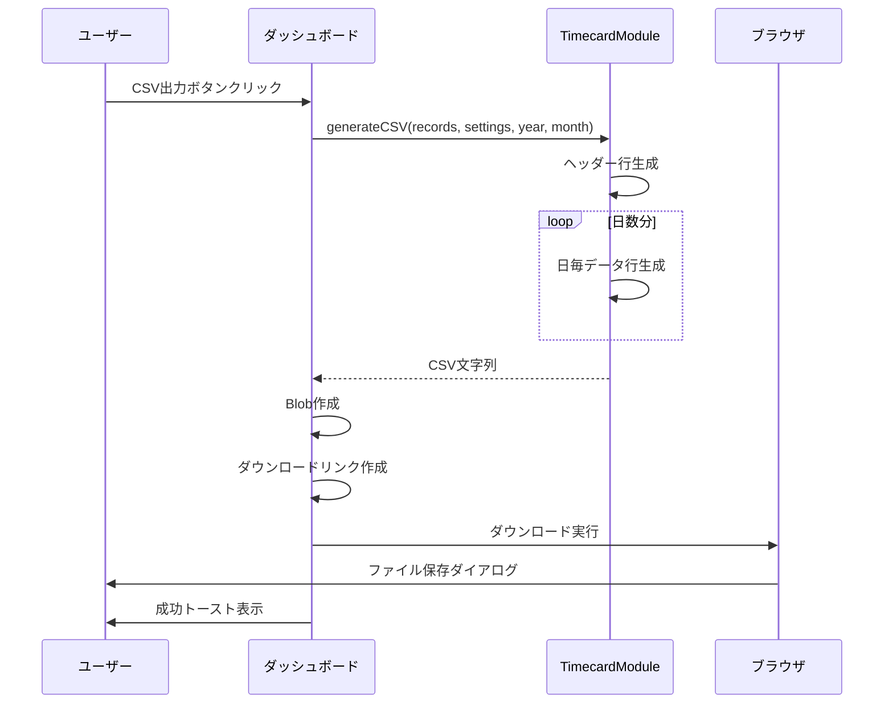

# シーケンス図

勤務月報システムの主要なシーケンスを示します。

## 1. ログイン処理

```mermaid
sequenceDiagram
    participant U as ユーザー
    participant L as ログインページ
    participant A as AuthModule
    participant S as Supabase Auth
    participant D as ダッシュボード
    
    U->>L: メールアドレス・パスワード入力
    U->>L: ログインボタンクリック
    L->>A: login(email, password)
    A->>S: signInWithPassword()
    
    alt 認証成功
        S-->>A: セッション情報
        A-->>L: {success: true, user}
        L->>D: リダイレクト
        D->>A: checkSession()
        A->>S: getSession()
        S-->>A: セッション情報
        A-->>D: セッション
        D->>A: getCurrentUser()
        A->>S: getUser()
        S-->>A: ユーザー情報
        A-->>D: ユーザー
        D->>D: 初期化完了
    else 認証失敗
        S-->>A: エラー
        A-->>L: {success: false, message}
        L->>U: エラーメッセージ表示
    end
```

## 2. 日毎勤務入力処理

```mermaid
sequenceDiagram
    participant U as ユーザー
    participant D as ダッシュボード
    participant M as DailyModal
    participant T as TimecardModule
    participant S as Supabase DB
    
    U->>D: 編集ボタンクリック
    D->>M: openDailyModal(day)
    M->>M: フォーム表示
    
    alt 既存記録あり
        M->>M: 既存データ設定
    else 既存記録なし
        M->>M: デフォルト値設定
    end
    
    U->>M: フォーム入力
    U->>M: 保存ボタンクリック
    
    M->>T: calculateWorkTime()
    T-->>M: 労働時間
    M->>T: calculateOvertime()
    T-->>M: 残業時間
    M->>T: calculateNightOvertime()
    T-->>M: 深夜残業時間
    
    M->>T: saveDailyRecord(record)
    T->>S: upsert daily_records
    
    alt 保存成功
        S-->>T: 成功
        T-->>M: {success: true}
        M->>D: closeDailyModal()
        D->>D: loadMonthData()
        D->>U: 成功トースト表示
    else 保存失敗
        S-->>T: エラー
        T-->>M: {success: false, message}
        M->>U: エラートースト表示
    end
```

## 3. 月間設定保存処理

```mermaid
sequenceDiagram
    participant U as ユーザー
    participant D as ダッシュボード
    participant T as TimecardModule
    participant S as Supabase DB
    
    U->>D: 月間設定タブ選択
    D->>D: updateMonthlySettingsForm()
    D->>U: フォーム表示
    
    U->>D: 設定入力
    U->>D: 保存ボタンクリック
    
    D->>T: saveMonthlySettings(settings)
    T->>S: select existing
    
    alt 既存設定あり
        T->>S: update monthly_settings
    else 既存設定なし
        T->>S: insert monthly_settings
    end
    
    alt 保存成功
        S-->>T: 成功
        T-->>D: {success: true}
        D->>U: 成功トースト表示
    else 保存失敗
        S-->>T: エラー
        T-->>D: {success: false, message}
        D->>U: エラートースト表示
    end
```

## 4. 承認申請処理

```mermaid
sequenceDiagram
    participant U as 一般ユーザー
    participant D as ダッシュボード
    participant A as ApprovalModule
    participant S as Supabase DB
    participant AP as 承認者
    
    U->>D: 承認申請ボタンクリック
    D->>D: confirm()
    U->>D: 確認OK
    
    D->>A: requestApproval(userId, year, month)
    A->>S: select existing approval
    
    alt 既存申請あり
        alt 承認済み
            A-->>D: {success: false, message: 'すでに承認されています'}
            D->>U: エラートースト表示
        else 未承認
            A->>S: update approvals (status: pending)
            S-->>A: 成功
            A-->>D: {success: true}
            D->>U: 成功トースト表示
        end
    else 既存申請なし
        A->>S: insert approvals (status: pending)
        S-->>A: 成功
        A-->>D: {success: true}
        D->>U: 成功トースト表示
    end
    
    D->>D: loadMonthData()
    Note over D: 編集不可に変更
```

## 5. 承認処理

```mermaid
sequenceDiagram
    participant AP as 承認者
    participant D as ダッシュボード
    participant A as ApprovalModule
    participant S as Supabase DB
    participant U as 一般ユーザー
    
    AP->>D: 承認管理タブ選択
    D->>A: getAllApprovals()
    A->>S: select approvals with user_profiles
    S-->>A: 承認一覧
    A-->>D: 承認一覧
    D->>D: loadApprovalList()
    D->>AP: 承認一覧表示
    
    AP->>D: 承認ボタンクリック
    D->>D: confirm()
    AP->>D: 確認OK
    
    D->>A: approve(approvalId, approverId)
    A->>S: update approvals (status: approved)
    S-->>A: 成功
    A-->>D: {success: true}
    D->>D: loadApprovalList()
    D->>AP: 成功トースト表示
    
    Note over U: 該当月のデータが編集不可に
```

## 6. 承認取消処理

```mermaid
sequenceDiagram
    participant AP as 承認者
    participant D as ダッシュボード
    participant A as ApprovalModule
    participant S as Supabase DB
    participant U as 一般ユーザー
    
    AP->>D: 取消ボタンクリック
    D->>D: confirm()
    AP->>D: 確認OK
    
    D->>A: cancelApproval(approvalId, approverId)
    A->>S: update approvals (status: draft)
    S-->>A: 成功
    A-->>D: {success: true}
    D->>D: loadApprovalList()
    D->>AP: 成功トースト表示
    
    Note over U: 該当月のデータが編集可能に
```

## 7. ユーザー管理処理

```mermaid
sequenceDiagram
    participant AD as 管理者
    participant D as ダッシュボード
    participant AM as AdminModule
    participant S as Supabase
    
    AD->>D: ユーザー管理タブ選択
    D->>AM: getAllUsers()
    AM->>S: select user_profiles
    S-->>AM: ユーザー一覧
    AM-->>D: ユーザー一覧
    D->>AD: ユーザー一覧表示
    
    AD->>D: 新規ユーザー追加ボタンクリック
    D->>D: openUserModal()
    D->>AD: モーダル表示
    
    AD->>D: フォーム入力
    AD->>D: 保存ボタンクリック
    
    D->>AM: createUser(userData)
    AM->>S: auth.admin.createUser()
    S-->>AM: ユーザー作成成功
    AM->>S: insert user_profiles
    S-->>AM: プロフィール作成成功
    AM-->>D: {success: true}
    
    D->>D: closeUserModal()
    D->>D: loadUserList()
    D->>AD: 成功トースト表示
```

## 8. CSVエクスポート処理

```mermaid
sequenceDiagram
    participant U as ユーザー
    participant D as ダッシュボード
    participant T as TimecardModule
    participant B as ブラウザ
    
    U->>D: CSV出力ボタンクリック
    D->>T: generateCSV(records, settings, year, month)
    
    T->>T: ヘッダー行生成
    
    loop 日数分
        T->>T: 日毎データ行生成
    end
    
    T-->>D: CSV文字列
    
    D->>D: Blob作成
    D->>D: ダウンロードリンク作成
    D->>B: ダウンロード実行
    B->>U: ファイル保存ダイアログ
    
    D->>U: 成功トースト表示
```
