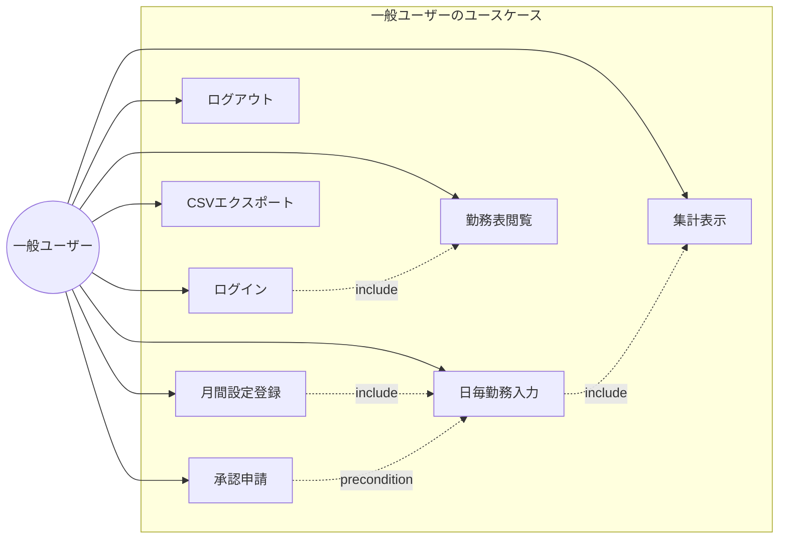
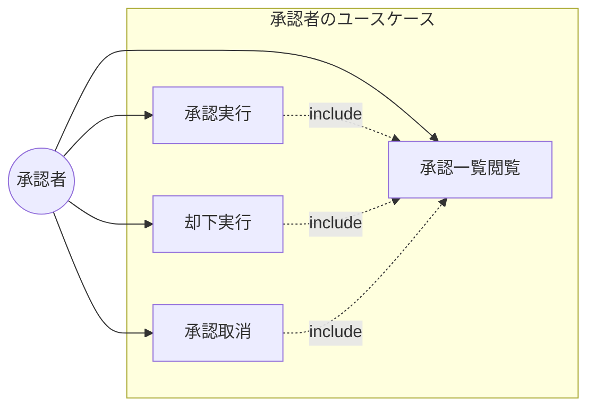
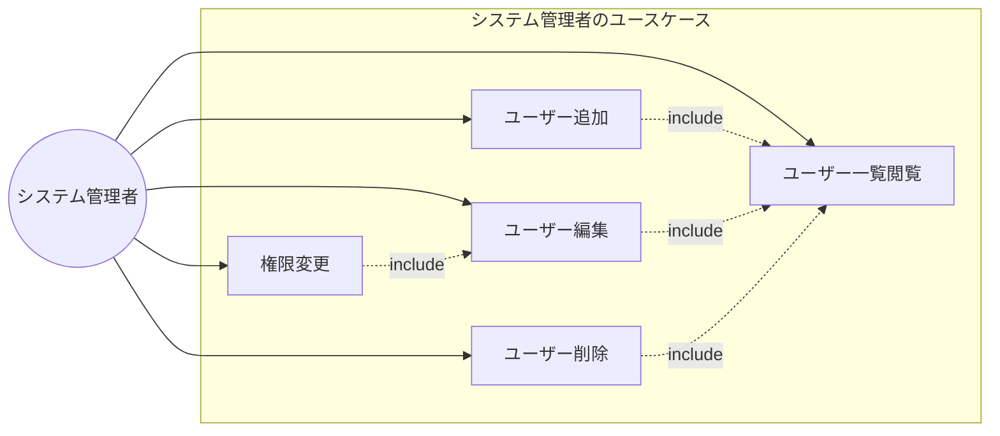

# ユースケース図

勤務月報システムのユースケースを示します。

## 全体ユースケース図

```mermaid
flowchart TB
    subgraph System["勤務月報システム"]
        UC1[ログイン]
        UC2[ログアウト]
        UC3[月間設定登録]
        UC4[日毎勤務入力]
        UC5[勤務表閲覧]
        UC6[集計表示]
        UC7[CSVエクスポート]
        UC8[承認申請]
        UC9[承認一覧閲覧]
        UC10[承認実行]
        UC11[却下実行]
        UC12[承認取消]
        UC13[ユーザー一覧閲覧]
        UC14[ユーザー追加]
        UC15[ユーザー編集]
        UC16[ユーザー削除]
        UC17[権限変更]
    end
    
    subgraph Actors["アクター"]
        A1((一般ユーザー))
        A2((承認者))
        A3((システム管理者))
    end
    
    %% 一般ユーザーのユースケース
    A1 --> UC1
    A1 --> UC2
    A1 --> UC3
    A1 --> UC4
    A1 --> UC5
    A1 --> UC6
    A1 --> UC7
    A1 --> UC8
    
    %% 承認者のユースケース（一般ユーザーの機能を継承）
    A2 --> UC1
    A2 --> UC2
    A2 --> UC3
    A2 --> UC4
    A2 --> UC5
    A2 --> UC6
    A2 --> UC7
    A2 --> UC8
    A2 --> UC9
    A2 --> UC10
    A2 --> UC11
    A2 --> UC12
    
    %% システム管理者のユースケース（一般ユーザーの機能を継承）
    A3 --> UC1
    A3 --> UC2
    A3 --> UC3
    A3 --> UC4
    A3 --> UC5
    A3 --> UC6
    A3 --> UC7
    A3 --> UC8
    A3 --> UC13
    A3 --> UC14
    A3 --> UC15
    A3 --> UC16
    A3 --> UC17
```

## アクター詳細

### 一般ユーザー（入力者）

自分の勤務情報を入力・管理するユーザー。

### 承認者

一般ユーザーの勤務表を承認・却下する権限を持つユーザー。

### システム管理者

ユーザーの追加・変更・削除を行う権限を持つユーザー。

## ユースケース詳細

### UC1: ログイン

| 項目 | 内容 |
|------|------|
| アクター | 全ユーザー |
| 概要 | システムにログインする |
| 事前条件 | アカウントが登録されている |
| 事後条件 | ログイン状態になる |
| 基本フロー | 1. メールアドレス入力 2. パスワード入力 3. ログインボタンクリック 4. ダッシュボードへ遷移 |
| 代替フロー | 認証失敗時はエラーメッセージ表示 |

### UC2: ログアウト

| 項目 | 内容 |
|------|------|
| アクター | 全ユーザー |
| 概要 | システムからログアウトする |
| 事前条件 | ログイン状態である |
| 事後条件 | ログアウト状態になる |
| 基本フロー | 1. ログアウトボタンクリック 2. ログインページへ遷移 |

### UC3: 月間設定登録

| 項目 | 内容 |
|------|------|
| アクター | 全ユーザー |
| 概要 | 月間の勤務パターンと設定を登録する |
| 事前条件 | ログイン状態である、承認済みでない |
| 事後条件 | 月間設定が保存される |
| 基本フロー | 1. 月間設定タブ選択 2. 氏名・所属入力 3. 勤務パターン設定 4. 標準就労時間設定 5. 保存ボタンクリック |
| 代替フロー | 前月設定をコピー可能 |

### UC4: 日毎勤務入力

| 項目 | 内容 |
|------|------|
| アクター | 全ユーザー |
| 概要 | 日毎の勤務情報を入力する |
| 事前条件 | ログイン状態である、承認済みでない |
| 事後条件 | 日毎の勤務記録が保存される |
| 基本フロー | 1. 日付の編集ボタンクリック 2. 勤務種類選択 3. 出勤・退勤時刻入力 4. 保存ボタンクリック |
| 代替フロー | 残業時間は自動計算されるが手動変更可能 |

### UC5: 勤務表閲覧

| 項目 | 内容 |
|------|------|
| アクター | 全ユーザー |
| 概要 | 月間の勤務一覧を閲覧する |
| 事前条件 | ログイン状態である |
| 事後条件 | なし |
| 基本フロー | 1. 勤務入力タブ選択 2. 月選択 3. 勤務一覧表示 |

### UC6: 集計表示

| 項目 | 内容 |
|------|------|
| アクター | 全ユーザー |
| 概要 | 月間の勤務集計を表示する |
| 事前条件 | ログイン状態である |
| 事後条件 | なし |
| 基本フロー | 1. 勤務入力タブ選択 2. 集計セクションを確認 |

### UC7: CSVエクスポート

| 項目 | 内容 |
|------|------|
| アクター | 全ユーザー |
| 概要 | 月間の勤務データをCSV形式でエクスポートする |
| 事前条件 | ログイン状態である |
| 事後条件 | CSVファイルがダウンロードされる |
| 基本フロー | 1. CSV出力ボタンクリック 2. ファイルダウンロード |

### UC8: 承認申請

| 項目 | 内容 |
|------|------|
| アクター | 全ユーザー |
| 概要 | 月間の勤務表の承認を申請する |
| 事前条件 | ログイン状態である、未承認である |
| 事後条件 | 承認待ち状態になる |
| 基本フロー | 1. 承認申請ボタンクリック 2. 確認ダイアログでOK |

### UC9: 承認一覧閲覧

| 項目 | 内容 |
|------|------|
| アクター | 承認者 |
| 概要 | 承認申請の一覧を閲覧する |
| 事前条件 | 承認権限を持っている |
| 事後条件 | なし |
| 基本フロー | 1. 承認管理タブ選択 2. 承認一覧表示 |

### UC10: 承認実行

| 項目 | 内容 |
|------|------|
| アクター | 承認者 |
| 概要 | 勤務表を承認する |
| 事前条件 | 承認権限を持っている、承認待ち状態である |
| 事後条件 | 承認済み状態になる、データがロックされる |
| 基本フロー | 1. 承認ボタンクリック 2. 確認ダイアログでOK |

### UC11: 却下実行

| 項目 | 内容 |
|------|------|
| アクター | 承認者 |
| 概要 | 勤務表を却下する |
| 事前条件 | 承認権限を持っている、承認待ち状態である |
| 事後条件 | 却下状態になる |
| 基本フロー | 1. 却下ボタンクリック 2. 却下理由入力 3. 却下実行 |

### UC12: 承認取消

| 項目 | 内容 |
|------|------|
| アクター | 承認者 |
| 概要 | 承認済みの勤務表を取り消す |
| 事前条件 | 承認権限を持っている、承認済み状態である |
| 事後条件 | 未申請状態になる、データのロックが解除される |
| 基本フロー | 1. 取消ボタンクリック 2. 確認ダイアログでOK |

### UC13: ユーザー一覧閲覧

| 項目 | 内容 |
|------|------|
| アクター | システム管理者 |
| 概要 | 登録ユーザーの一覧を閲覧する |
| 事前条件 | 管理者権限を持っている |
| 事後条件 | なし |
| 基本フロー | 1. ユーザー管理タブ選択 2. ユーザー一覧表示 |

### UC14: ユーザー追加

| 項目 | 内容 |
|------|------|
| アクター | システム管理者 |
| 概要 | 新規ユーザーを追加する |
| 事前条件 | 管理者権限を持っている |
| 事後条件 | 新規ユーザーが登録される |
| 基本フロー | 1. 新規追加ボタンクリック 2. ユーザー情報入力 3. 保存ボタンクリック |

### UC15: ユーザー編集

| 項目 | 内容 |
|------|------|
| アクター | システム管理者 |
| 概要 | 既存ユーザーの情報を編集する |
| 事前条件 | 管理者権限を持っている |
| 事後条件 | ユーザー情報が更新される |
| 基本フロー | 1. 編集ボタンクリック 2. 情報更新 3. 保存ボタンクリック |

### UC16: ユーザー削除

| 項目 | 内容 |
|------|------|
| アクター | システム管理者 |
| 概要 | ユーザーを削除する |
| 事前条件 | 管理者権限を持っている |
| 事後条件 | ユーザーが削除される |
| 基本フロー | 1. 削除ボタンクリック 2. 確認ダイアログでOK |

### UC17: 権限変更

| 項目 | 内容 |
|------|------|
| アクター | システム管理者 |
| 概要 | ユーザーの権限を変更する |
| 事前条件 | 管理者権限を持っている |
| 事後条件 | ユーザーの権限が更新される |
| 基本フロー | 1. 編集ボタンクリック 2. 権限チェックボックス変更 3. 保存ボタンクリック |
